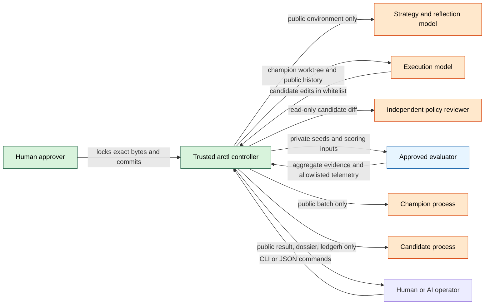
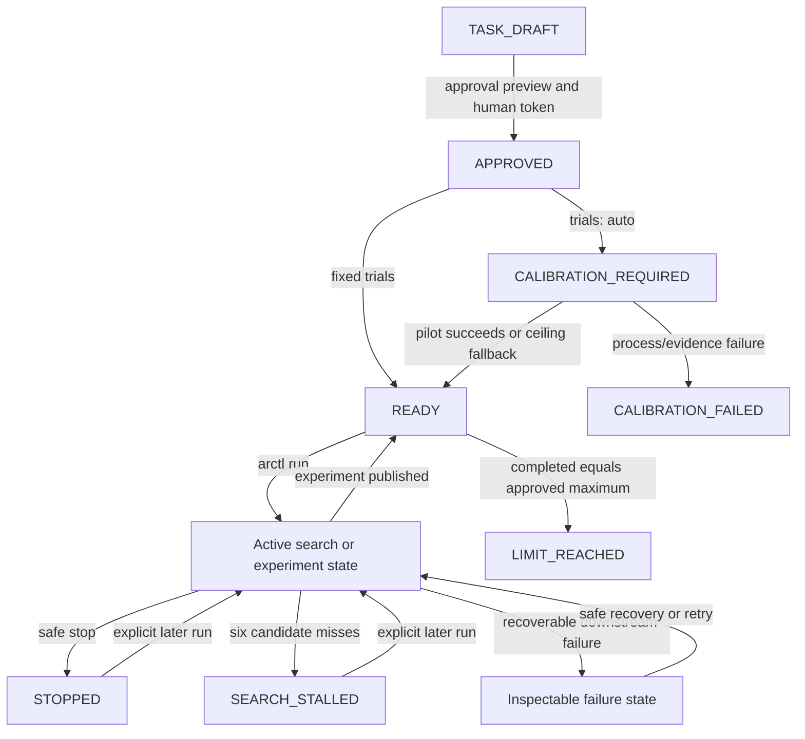
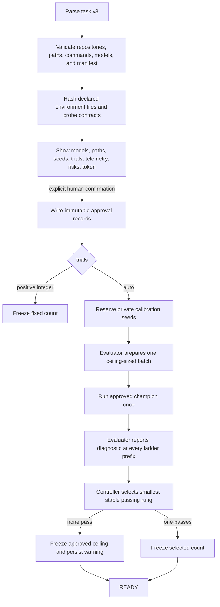
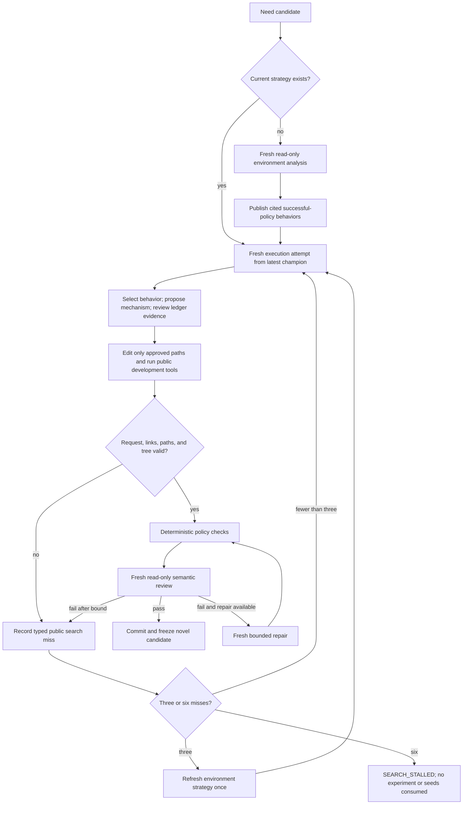
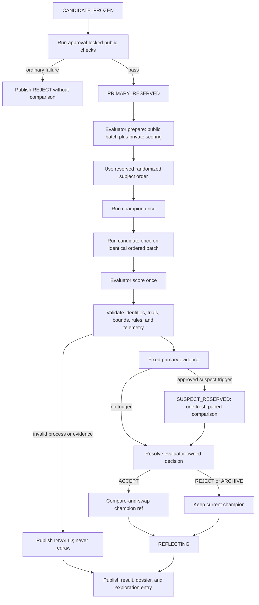
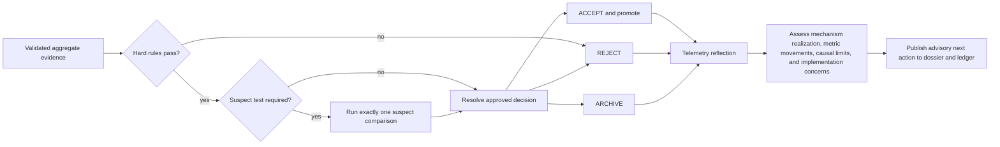
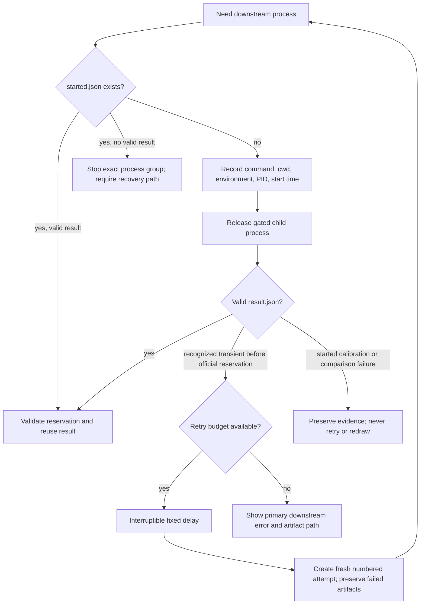

# arctl design

This document describes the current controller implemented in `src/arctl`. It
is an operational map for task authors, evaluator authors, human reviewers, and
AI operators. The [MVP specification](../arctl_light_mvp_spec_simple.md) remains
the normative contract; this document emphasizes how the pieces fit together.

## The loop at a glance

```text
  HUMAN + APPROVED CONFIGURATION
  ┌──────────────────────────────────────────────────────────────────────┐
  │ task.yaml + evaluator commit + manifest + environment + champion    │
  └───────────────────────────────┬──────────────────────────────────────┘
                                  │ approve once
                                  v
  ┌──────────────┐     auto      ┌───────────────┐
  │ Freeze trials│<──────────────│ Calibrate     │
  │ (fixed/auto) │               │ champion once │
  └──────┬───────┘               └───────────────┘
         │
         v
  ┌────────────────┐   derive   ┌────────────────────────┐
  │ Understand the │───────────>│ Successful-policy      │
  │ environment    │            │ behaviors (strategy)   │
  └────────────────┘            └────────────┬───────────┘
                                             │
                 ┌───────────────────────────v──────────────────────────┐
                 │ Start from latest champion; propose one mechanism;   │
                 │ inspect public history; edit only approved paths     │
                 └───────────────────────────┬──────────────────────────┘
                                             │ candidate
                                             v
                 ┌──────────────────────────────────────────────────────┐
                 │ Static checks -> independent review -> optional      │
                 │ bounded repair -> freeze candidate commit            │
                 └───────────────────────────┬──────────────────────────┘
                                             │
                                             v
                 ┌──────────────────────────────────────────────────────┐
                 │ Public checks -> reserve paired seeds -> prepare     │
                 │ batch -> run both subjects -> score -> validate      │
                 └───────────────────────────┬──────────────────────────┘
                                             │ fixed evidence
                          ┌──────────────────┴──────────────────┐
                          v                                     v
                  ACCEPT / promote                 REJECT / ARCHIVE / INVALID
                          └──────────────────┬──────────────────┘
                                             v
                 ┌──────────────────────────────────────────────────────┐
                 │ Telemetry reflection -> publish result + dossier ->  │
                 │ append public ledger -> loop until stop/stall/limit  │
                 └──────────────────────────────────────────────────────┘
```

The central rule is simple: language models may propose and interpret, but
only the approved evaluator's frozen comparison protocol can decide whether a
candidate is promoted.

## Actors and trust boundaries



- **The controller** owns state transitions, Git refs, seeds, process records,
  validation, publication, and compare-and-swap promotion.
- **The evaluator** owns the statistic, uncertainty method, calibration
  diagnostic, suspect-test rule, telemetry contract, and final decision rule.
- **Strategy** studies the environment, not the current policy. It produces
  cited environment observations and implementation-independent behaviors.
- **Execution** starts from the latest accepted champion, reads public history,
  chooses one strategic behavior, and implements one testable mechanism.
- **Review and reflection** are advisory methodology checks. Neither can alter
  the evaluator's verdict.

## Task lifecycle



`max_experiments` is an approval-locked lifetime ceiling. The
`--max-experiments` option is only a smaller per-invocation bound. Reaching the
task ceiling produces `LIMIT_REACHED`; it does not run calibration again or
pretend that an empty invocation tested a candidate.

## Approval and automatic calibration

Approval locks the task file hash, evaluator commit, evaluator manifest hash,
initial champion, and hashes of every declared environment source. Changing
any of those inputs requires a new approval. Promotion may move the champion
ref afterward; calibration remains bound to the initial approved champion.



Calibration estimates an approved baseline property; it is not a power
guarantee for every future effect. A ceiling fallback remains visible in
`status`, `report`, `inspect`, and run progress.

## Strategy and candidate search

Strategy and execution deliberately have different information. Strategy sees
the objective as a boundary plus approval-locked environment sources and
policy-free probes. It does not see the champion, evaluator statistic,
telemetry targets, or exploration ledger. Execution sees the current champion,
strategy behaviors, editable-path contract, public probes, and public history.



Exact duplicate Git trees are hard misses. Semantic similarity is only ledger
guidance, allowing deliberate refinements rather than crashing when a related
hypothesis reappears.

## Experiment and comparison

An official experiment is allocated only after a candidate has passed the
search and review gates. Public checks can reject it before private seeds are
reserved. After reservation, comparison work is exactly once.



Champion and candidate receive the same ordered public cases but never receive
private scoring data, evaluator code, controller storage, or trial identities.
The controller validates the evaluator's protocol and evidence shape; it does
not independently prove the evaluator's mathematics.

## Decisions and telemetry reflection

The primary evidence contains the effect estimate, one-sided lower bound, hard
rule result, suspect-test request, and every manifest-declared public telemetry
metric. The approved evaluator maps that evidence to the final decision.



Reflection cannot turn a rejection into an acceptance. Its job is to explain
what the aggregates do and do not support: for example, whether a positive mean
with a negative lower bound appears driven by variance, whether telemetry
supports the proposed mechanism, or whether the implementation failed to
express the intended strategic behavior.

## Persistence, recovery, and retries

Every managed process records its identity before its command is released. A
saved valid result is reused. A process that started without a valid result is
not silently rerun in the same process record.



`arctl run --retries N --retry-delay SECONDS` opts into retries for recognized
Codex capacity/rate-limit/network/timeouts and transient network failures in
pre-trial public processes. The count is consecutive and resets after a
successful downstream stage. Ctrl-C or `arctl stop` interrupts the delay.

## Storage and audit trail

Git and validated files are authoritative; no database is required. The main
task directory contains:

```text
TASK/
├── task.yaml                         # approval-locked task configuration
├── approval.json                     # hashes and initial champion
├── evaluator.commit
├── evaluator.manifest.json
├── trial-count.json                  # fixed count and calibration summary
├── calibration/                      # private requests, process records, outputs
├── strategy/
│   ├── 000001.public.json            # environment observations and behaviors
│   └── 000001/                       # process and failure artifacts
├── searches/000001/attempts/01/      # executor and candidate-review attempts
├── experiments/000001/
│   ├── request.public.json
│   ├── candidate.commit
│   ├── comparisons/primary/          # private reservation and evidence
│   ├── result.public.json            # allowlisted aggregate result
│   ├── reflection.public.json
│   └── published
├── exploration/ledger.public.jsonl   # strategy, misses, results, reflections
└── reports/experiments/000001/        # immutable public Markdown dossier
```

The dossier is derived, public-only, and readable by a human. Private
reservations, seeds, cases, schedules, evaluator outputs, raw subject outputs,
commands, and environments are never linked into it.

## Operator interface

Humans normally use `run`, `status`, `stop`, `report`, `history`, and
`inspect`. AI operators use the same commands with `--json`; research agents
never receive operator authority. Human `status` and `report` output uses
bounded-width tables; champion displays identify the promoting experiment and
hypothesis, while machine JSON retains exact evidence values. See the exact [command
reference](cli-reference.md), which is mechanically mirrored from `arctl -h`
and every `arctl COMMAND -h` screen.

Related documents:

- [Evaluator design boundary](evaluator-design.md)
- [Empirical validation protocols](empirical-validation.md)
- [MVP specification](../arctl_light_mvp_spec_simple.md)
