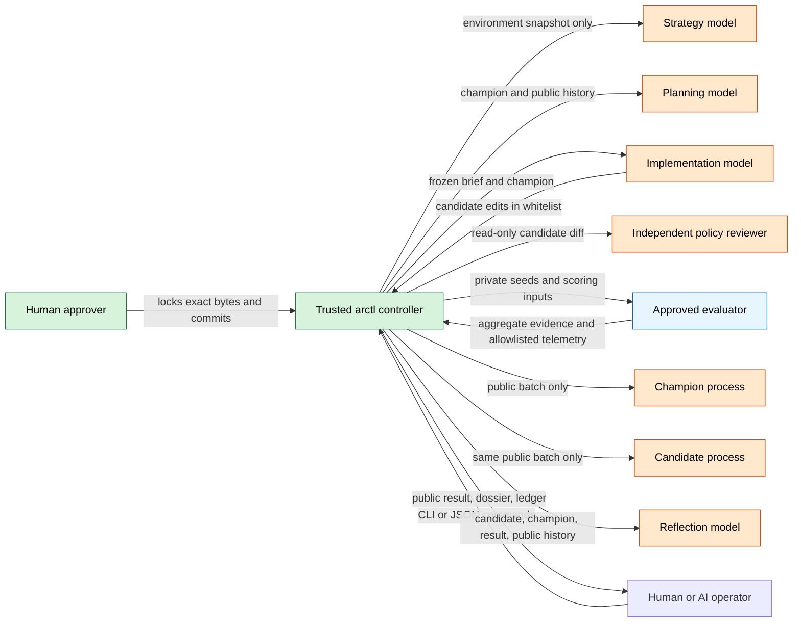
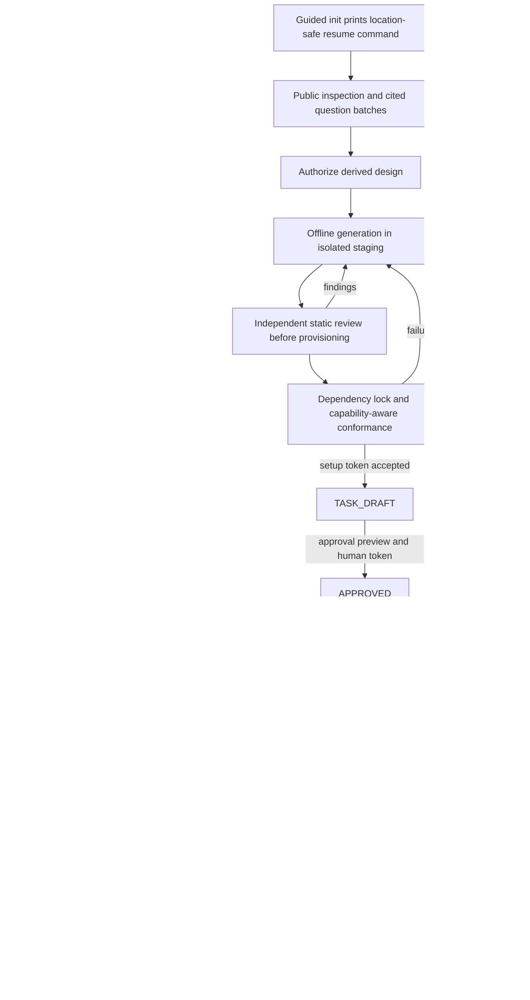
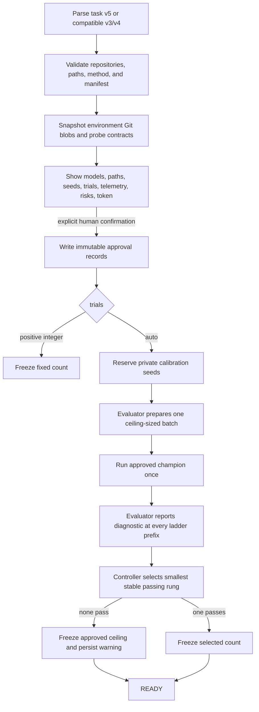
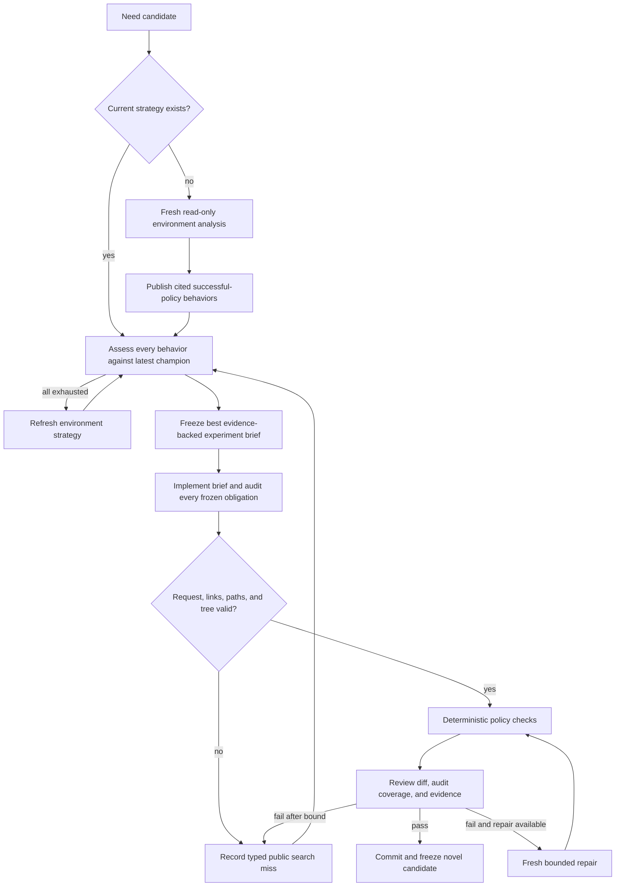
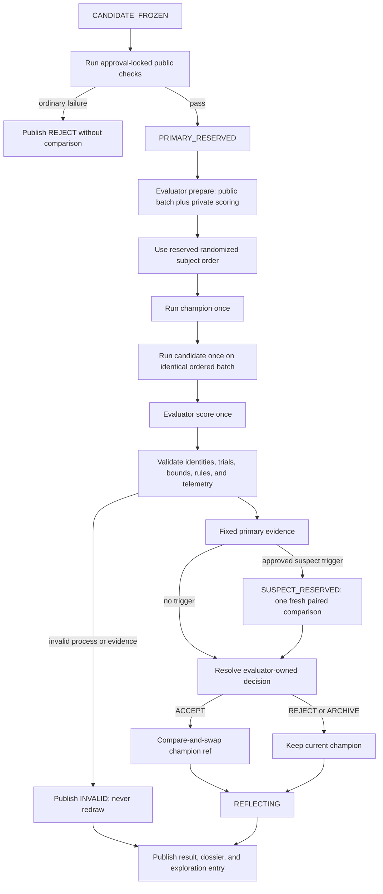
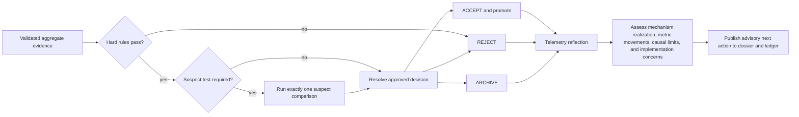
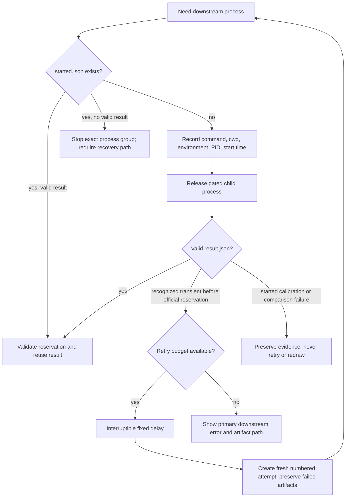

# arctl design

This document describes the current controller implemented in `src/arctl`. It
is an operational map for task authors, evaluator authors, human reviewers, and
AI operators. The [MVP specification](../arctl_light_mvp_spec_simple.md) remains
the normative contract; this document emphasizes how the pieces fit together.

## The loop at a glance

```text
  HUMAN + APPROVED CONFIGURATION
  ┌──────────────────────────────────────────────────────────────────────┐
  │ task.yaml + evaluator commit + manifest + environment + champion    │
  └───────────────────────────────┬──────────────────────────────────────┘
                                  │ approve once
                                  v
  ┌──────────────┐     auto      ┌───────────────┐
  │ Freeze trials│<──────────────│ Calibrate     │
  │ (fixed/auto) │               │ champion once │
  └──────┬───────┘               └───────────────┘
         │
         v
  ┌────────────────┐   derive   ┌────────────────────────┐
  │ Understand the │───────────>│ Successful-policy      │
  │ environment    │            │ behaviors (strategy)   │
  └────────────────┘            └────────────┬───────────┘
                                             │
                 ┌───────────────────────────v──────────────────────────┐
                 │ Compare every behavior against the latest champion; │
                 │ freeze one brief, then implement only that brief     │
                 └───────────────────────────┬──────────────────────────┘
                                             │ candidate
                                             v
                 ┌──────────────────────────────────────────────────────┐
                 │ Static checks -> independent review -> optional      │
                 │ bounded repair -> freeze candidate commit            │
                 └───────────────────────────┬──────────────────────────┘
                                             │
                                             v
                 ┌──────────────────────────────────────────────────────┐
                 │ Public checks -> reserve paired seeds -> prepare     │
                 │ batch -> run both subjects -> score -> validate      │
                 └───────────────────────────┬──────────────────────────┘
                                             │ fixed evidence
                          ┌──────────────────┴──────────────────┐
                          v                                     v
                  ACCEPT / promote                 REJECT / ARCHIVE / INVALID
                          └──────────────────┬──────────────────┘
                                             v
                 ┌──────────────────────────────────────────────────────┐
                 │ Telemetry reflection -> publish result + dossier ->  │
                 │ append public ledger -> loop until stop or limit     │
                 └──────────────────────────────────────────────────────┘
```

The central rule is simple: language models may propose and interpret, but
only the approved evaluator's frozen comparison protocol can decide whether a
candidate is promoted.

## Actors and trust boundaries



- **The controller** owns state transitions, Git refs, seeds, process records,
  validation, publication, and compare-and-swap promotion.
- **The evaluator** owns the statistic, uncertainty method, calibration
  diagnostic, suspect-test rule, telemetry contract, and final decision rule.
- **Strategy** studies the environment, not the current policy. It produces
  cited environment observations and implementation-independent behaviors.
- **Planning** starts from the latest accepted champion, searches a compact public
  catalog, and gives each candidate direction one authoritative request. Selection
  references the chosen direction; it never restates or paraphrases the mechanism.
- **Implementation** receives that frozen request and current code, not the growing
  research history.
- **Review** controls pre-trial admission but cannot evaluate outcomes.
  **Reflection** interprets completed evidence but cannot alter its verdict.

## Task lifecycle



Guided setup is resumable pre-approval scaffolding, not research and not
scientific approval. Its agents cannot read evaluator-private data. Generated
public trees are hashed after review; acceptance refuses changed trees, creates
local commits, and never pushes. `init` leaves the supplied source repository
untouched and locally clones it into a non-Git shell workspace containing the
independent `subject`, `environment`, and `evaluator` repositories. The workspace
subject changes only on an `arctl/setup-*` branch. The setup agent implements typed subject, preparation,
calibration, scoring, and telemetry hooks. Controller-owned entrypoints compile
Python execution descriptors into the task-v5/manifest-v4 setup protocol and enforce
the declared telemetry wire shapes. Unsupported process-resource guarantees
remain advisory instead of becoming nullable evaluator metrics. The generated evaluator includes public hook tests,
but the human still owns the evaluator's mathematical validity at `approve`.
Human intent comes from explicit revisioned setup answers. Discovery inspects
public code offline and asks up to three related, cited decisions per batch. Every
option displays its exact persisted value. Objective, outcome, and editable boundary
require a human source; environment adapter, outcome extraction, finite horizon,
conformance, and dependencies are typed in the final design while derived values
retain their repository or controller provenance. `ARCTL_SETUP.md` is generated only
after acceptance as a readable view of the structured decision and design state.
The specialist inspects environment code and recommends the
sampling, randomness, calibration, uncertainty, and telemetry design rather
than delegating those mechanics to the user. Setup prints live discovery,
generation,
dependency, validation, check, and review stages with direct failure details.
Comparator freezing, paired-batch execution, seed non-reuse, calibration
selection, promotion mapping, and unscored operational failures are
controller-owned invariants rather than setup questions. Unsupported operational
guarantees require one explicit advisory-downgrade confirmation. Recommendations state
their assumptions and use conservative conventional choices when evidence is
incomplete.
Confirmed decisions constrain one hash-bound authorized design snapshot consumed
without lossy translation by generation and review. The builder writes disposable staging repositories and returns a
compact report rather than source code in JSON. The controller validates and
reviews the resulting files before provisioning authorized direct dependencies,
then locks the resolved graph and permits one error-directed repair. Invalid
retries preserve their immutable diagnostics.
An unfinished contract repair resumes from the saved generation instead of
rerunning the expensive generation stage.
Generated tests, protocol hooks, public checks, and the public probe run as
bounded managed process groups inside filesystem and network sandboxes. The
setup token binds the authorization bundle, staging trees, task draft,
owned-file list, subject base, and review result. A later edit clears the token; the next `arctl setup` records
the changes, reruns only their dependent checks plus setup review, and returns a
replacement token. Acceptance requires an empty Git index and stages only
reviewed owned paths.

`max_experiments` is an approval-locked lifetime ceiling or `unlimited`. The
`--max-experiments` option is only a smaller per-invocation bound. Reaching the
task ceiling produces `LIMIT_REACHED`; it does not run calibration again or
pretend that an empty invocation tested a candidate.

## Approval and automatic calibration

Approval locks the task file, resolved method, backend attestations, evaluator
commit and manifest, initial champion, and every declared environment Git
blob. Changing any semantic input requires a new approval. Promotion may move
the champion ref afterward; calibration remains bound to the approved initial
champion.



Calibration estimates an approved baseline property; it is not a power
guarantee for every future effect. A ceiling fallback remains visible in
`status`, `report`, `inspect`, and run progress.

## Strategy and candidate search

Strategy, planning, and execution deliberately have different information. Strategy sees
the objective as a boundary plus approval-locked environment sources and
policy-free probes. It does not see the champion, evaluator statistic,
telemetry targets, or current policy. Planning sees the current champion,
strategy behaviors, and the searchable public catalog but cannot edit. Execution
receives one direction-owned frozen brief and may edit only approved paths.



Exact duplicate Git trees are hard misses. Semantic similarity is only ledger
guidance, allowing deliberate refinements rather than crashing when a related
hypothesis reappears.

## Experiment and comparison

An official experiment is allocated only after a candidate has passed the
search and review gates. Public checks can reject it before private seeds are
reserved. After reservation, comparison work is exactly once.



Champion and candidate receive the same ordered public cases but never receive
private scoring data, evaluator code, controller storage, or trial identities.
The controller validates the evaluator's protocol and evidence shape; it does
not independently prove the evaluator's mathematics.

## Decisions and telemetry reflection

The primary evidence contains the effect estimate, one-sided lower bound, hard
rule result, suspect-test request, and every manifest-declared public telemetry
metric. The approved evaluator maps that evidence to the final decision.



Reflection cannot turn a rejection into an acceptance. Its job is to explain
what the aggregates do and do not support: for example, whether a positive mean
with a negative lower bound appears driven by variance, whether telemetry
supports the proposed mechanism, or whether the implementation failed to
express the intended strategic behavior.

## Persistence, recovery, and retries

Every managed process records its identity before its command is released. A
saved valid result is reused. A process that started without a valid result is
not silently rerun in the same process record.



`arctl run --retries N --retry-delay SECONDS` opts into retries for recognized
Codex capacity/rate-limit/network/timeouts and transient network failures in
pre-trial public processes. The count is consecutive and resets after a
successful downstream stage. Ctrl-C or `arctl stop` interrupts the delay.
Published execution failures carry a sanitized explanation. Human views label
results without valid comparison evidence as `No score` and retain the reason in
the experiment dossier.

## Storage and audit trail

Git and validated files are authoritative; no database is required. The main
task directory contains:

```text
TASK/
├── task.yaml                         # approval-locked task configuration
├── approval.json                     # hashes and initial champion
├── evaluator.commit
├── evaluator.manifest.json
├── environment/                      # approval-locked Git-blob snapshots
├── trial-count.json                  # fixed count and calibration summary
├── calibration/                      # private requests, process records, outputs
├── strategy/
│   ├── 000001.public.json            # environment observations and behaviors
│   └── 000001/                       # process and failure artifacts
├── searches/000001/attempts/01/      # executor and candidate-review attempts
├── experiments/000001/
│   ├── request.public.json
│   ├── candidate.commit
│   ├── comparisons/primary/          # private reservation and evidence
│   ├── result.public.json            # allowlisted aggregate result
│   ├── reflection.public.json
│   └── published
├── exploration/
│   ├── entries/                      # full immutable canonical records
│   ├── ledger.public.jsonl           # compact deterministic search catalog
│   └── direction-exhaustion.public.jsonl
└── reports/experiments/000001/        # immutable public Markdown dossier
```

Agent selections, backend attestations, and session provenance are persisted
beside their lifecycle artifacts. Prompts are immutable `prompt.public.txt`
files, limited to 32 KiB and hashed before execution. The Codex adapter streams
them over standard input; other adapters must preserve the same contract.
Growing history stays in the catalog and canonical entries instead of being
copied into each prompt.

The dossier is derived, public-only, and readable by a human. Private
reservations, seeds, cases, schedules, evaluator outputs, raw subject outputs,
commands, and environments are never linked into it.

## Operator interface

Humans normally use `run`, `status`, `stop`, `report`, `history`, and
`inspect`. AI operators use the same commands with `--json`; research agents
never receive operator authority. Human `status` and `report` output uses
bounded-width tables; champion displays identify the promoting experiment and
hypothesis, while machine JSON retains exact evidence values. See the exact [command
reference](cli-reference.md), which is mechanically mirrored from `arctl -h`
and every `arctl COMMAND -h` screen.

Related documents:

- [Research methods and agent backends](research-methods.md)
- [Evaluator design boundary](evaluator-design.md)
- [Empirical validation protocols](empirical-validation.md)
- [MVP specification](../arctl_light_mvp_spec_simple.md)
